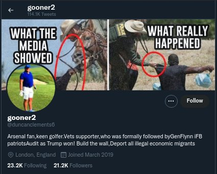
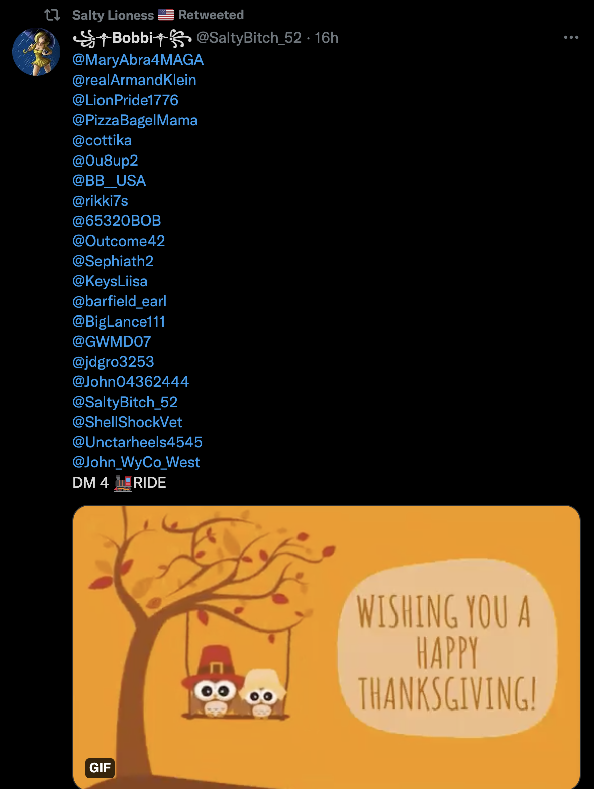
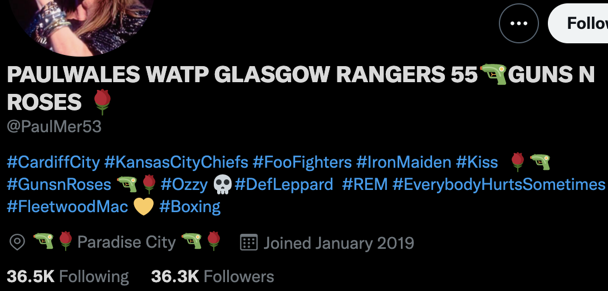
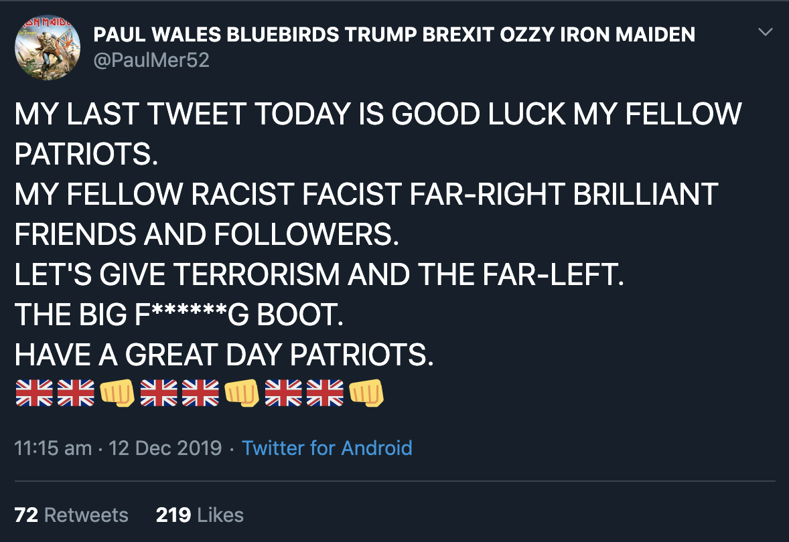
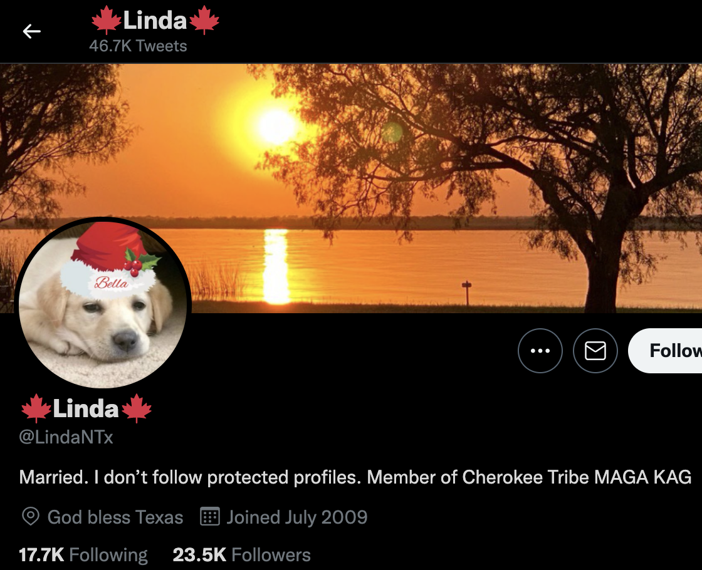

# inauthentic_twitter_nov2021
An analysis of follow-back networks on Twitter from Nov. 2021

# Introduction
Follow-back behaviour on Twitter is not a new phenomenon, nor is it always used for malicious purposes. However, follow-back mechanisms, when applied en-masse, via thousands of high-volume accounts can be an indicator of inauthentic behaviour and potentially automation. Such mechanisms can be used to cultivate accounts for the purpose of spreading disinformation. Although the existance of such high-volume follow-back mechanisms is well-known on Twitter, it is rarely the subject of investigation. The is because (i) Twitter's free API rate limits prohibit the ability to crawl networks of users and properly capture all accounts involved in this activity, and (ii) the sheer size of these networks mean that crawling this space can take a very long time.

This short report details the methodology used to capture accounts participating in follow-back behaviour, and includes data as a starting point that we hope Twitter's Safety team will act upon.

# Motivation
The motivation to define the scope of an inauthentic follow-back group was prompted by an account I discovered while looking into COVID-related disinformation. The account, duncanclements6, is pictured below.

An analysis of this account was conducted by botvolution and can be found here: https://twitter.com/botvolution/status/1463108224920571908

This fake account, disguised as a football fan from London (but actually operated from the US), was responsible for the heavy promotion of follow-back spam at the time of initial inspection. The account posted many tweets containing long lists of usernames, followed by a meme image, or short piece of text. This mechanism, in addition to being used to propagate large follow-back networks, was designed to fish for likes, retweets, and replies. In addition to posting its own follow-back-style tweets, it retweeted similar content, and often replied to other follow-back-styled tweets asking for follows. Scrolling through the account's timeline, it was apparent that the duncanclements6 account repeatedly retweeted the same accounts that were also participating in similar username spam activities. A few of these were noted via manual inspection: Star7lt, USARGB, jAlmz5, duckusa, 8_27J, KeysLiisa, VuDeja4, and emma6USA. 

The account had just been suspended at the time of writing, and it is unknown whether it was a temporary or permanent suspension.

At this juncture, it was hypothesised that there must be other accounts participating in this group, and that manual analysis would be too cumbersome to identify them all. As such, automation was created to explore this phenomenon.

# Methodology
A rudimentary script was created to search for additional accounts participating in this inauthentic activity. The script was designed to perform the following actions:
- obtain a Twitter screen_name from a list of unqueried accounts (seeded from the accounts listed above)
- using the Twitter API, obtain that account's most recent 1000 tweets
- iterate through captured tweets in order to identify tweets containing 7 or more account mentions
- record the url of the follow-back-style original tweet, the screen_name of the account that published or retweeted the original tweet, and a list of accounts mentioned in the tweet
- if the screen_name of the account that published or retweeted the tweet wasn't on the list of unqueried accounts, append it
- repeat

Here is an example of a tweet matching the criterion:

The script was allowed to run from 14:00 November 24th 2021 to 11:00 November 25th 2021 UST. Note that the script was terminated before it had been able to query all accounts. As such, the data collected cannot be considered exaustive. Many more participants likely exist that were not discovered during this process.

# Results and discussion
The following statistics were gathered.
1. The number of accounts engaged in follow-back tweet behaviour identified during the script's run was 2468. A full list of Twitter user id_str values for these accounts can be found in this repository in a file named **fbid.json**. Accounts on this list should be investigated by the Twitter Safety team.
2. The number of tweets matching the script's criteria was 85,894. The full list of tweet urls can be found in this repository in a file named **urls.txt**. This file is made available so that researchers are able to verify that the script only captured relevant tweets. Investigation of these tweets by the Twitter Safety team should be considered.
3. The number of unique accounts mentioned on user account lists in tweets that met the script's criteria was 15,601. This list can be found in this repository in a file named **tofollow.json**. The list contains screen_names, since the accounts were not queried via the API for their user id_str values. Since any user can mention any screen_name in a tweet, without the consent of the screen_name's owner, it would not be safe to automate actions on this list of accounts. However, they are provided since it is assumed that a majority of the accounts are willing participants in the follow-back scheme, and thus further analysis of these accounts could prove useful.

A graph of retweet interactions between these accounts is illustrated below.

As illustrated, the script ended up crawling several regional followback groups, even though it was only seeded with accounts in the US space. In fact, the UK/US-based followback cluster is rather small in relation to the entire graph. Tweets captured across all regions followed a similar modus operandi - long lists of accounts, and an image. Images often depicted animals, nature, holiday greetings, and sometimes localized political content. For instance, the tweets captured in the UK/US cluster often contained pictures of Donald Trump, or anti-Biden memes. Topical content was also observed, such as images depicting support for Kyle Rittenhouse.

Some of the accounts in the dataset were observed sharing content in multiple languages. Some of the captured accounts were observed to only publish or share tweets in the followback format. Accounts in the UK/US cluster were by-and-large high-volume, often publishing more than 200 tweets per day. They also often had large (and roughly similar) numbers of following and followers. Many accounts participating in the UK/US cluster were observed to share COVID-related disinformation, anti-vax conspiracy theories, racist content, QAnon-related content, and extremist material. The nature of the content shared by non-English-language accounts was not investigated.

Some of the identified accounts have been actively participating in this behaviour for several years. For instance, the script discovered the PaulMer53 account, a rename of the PaulMer52 account observed participating in pro-Brexit content amplification during the 2019 UK General election.

The fact that this same account participated in aggressive pro-Brexit, pro-Tory activity during the 2019 UK election and is now embedded with, and pushing a pro-Trump, anti-Biden narrative is somewhat suspicious, but also speaks to the global reach of these amplification networks. Prior to being PaulMer52 and PaulMer53, this account manifested as both paulmer51 and paulmer70053201.

Also observed were accounts that auto-delete tweets at a rapid rate. For instance, according to Twitter's UI, this account has published 46.7k tweets. The script was ony able to obtain 175 tweets from the account, meaning that the rest were deleted, likely by automation.

# Conclusion
The follow-back mechanisms detailed in this report are not new, and have been described by multiple researchers, for many years. The methodology presented in this report for identifying these networks of accounts is very simple, and data gathering using the described mechanisms can be performed despite Twitter's rate limits.

The majority of the accounts identified during this research are likely being used to cultivate social network personas for a variety of purposes that may include (i) inauthentic amplification of content, (ii) to be sold to others, (iii) to be used by disinformation-as-a-service operations, or (iv) as part of nation-state social media manipulation infrastructure.

The UK/US-based cluster is already being used to amplify extremist and divisive content on Twitter. The actions of this group of users can be a detriment to society and can contribute to major societal problems, such as the January 6th attack on the US Capitol building and recent riots related to the refusal of the COVID-19 vaccine. The group's high-volume activity directly contributes to the amplification of content, some of which is designed to cause societal divide, spread harmful disinformation, and gravitate people towards extremist viewpoints. Many of the accounts identified in this research have likely been participating in this activity for years. 

The data provided in this repository represents a starting point for analysis of these groups as a whole. The contributors to this research hope that Twitter's Safety team perform such an analysis and take appropriate actions to curb these mechanisms once and for all.
